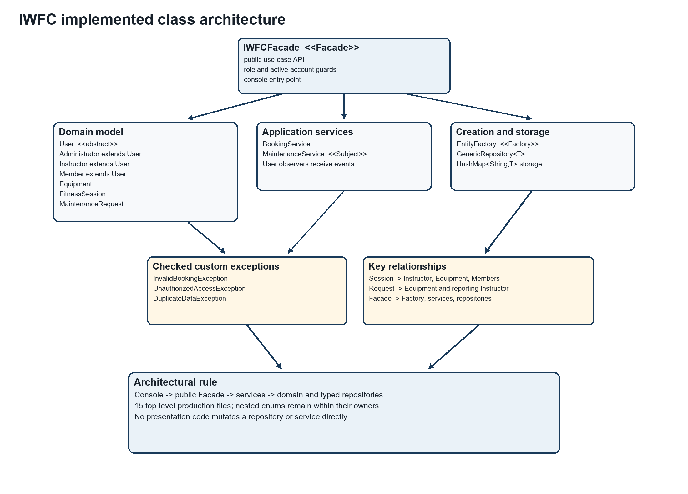
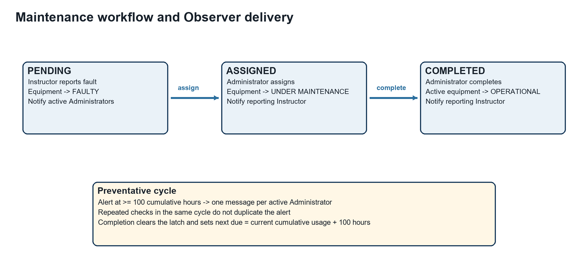
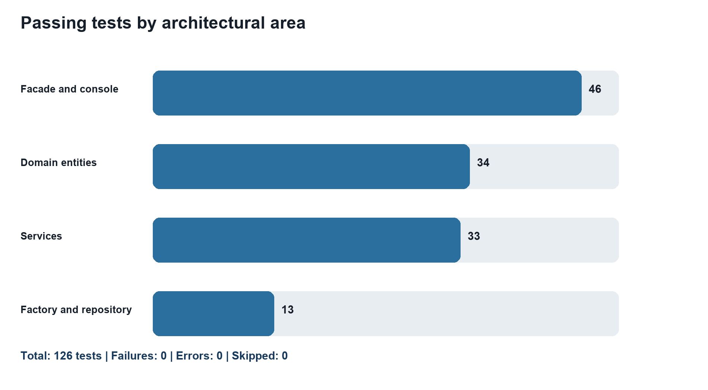

# Intelligent Wellness and Fitness Center Java Prototype

## CMP 7001 Advanced Programming PRAC1 Report

**Student:** Mohamed Rifad  
**Student ID:** [STUDENT ID]  
**Module tutor:** [MODULE TUTOR]  
**Submission date:** [SUBMISSION DATE]  
**Repository:** https://github.com/MohamedRifad/intelligent-wellness-and-fitness-center

## Executive Summary

This report presents the design, implementation and evaluation of the Intelligent Wellness and Fitness Center (IWFC), a Java 21 console prototype that replaces fragmented manual processes with coordinated equipment, session-booking and maintenance workflows. The solution contains exactly 15 production Java classes and applies object-oriented principles, collections, generics, custom exceptions and three complementary design patterns. A Factory centralises entity creation, a Facade provides a secure use-case boundary, and an Observer workflow delivers maintenance events to relevant active users.

The prototype supports Administrator-controlled accounts and equipment, Instructor-controlled scheduling and fault reporting, Member session discovery and booking, cumulative equipment usage, and a guarded maintenance lifecycle. Scheduling rejects operating-hours violations and overlapping Instructor, studio or equipment allocations. Maintenance follows `PENDING -> ASSIGNED -> COMPLETED`, while preventative alerts occur at an inclusive 100-hour threshold and reset safely after completed maintenance.

Verification used JUnit Jupiter and Maven. The final suite comprises 126 passing tests in 14 test classes, with no failures, errors or skipped tests. Tests cover successful use cases, authorization, duplicate data, invalid transitions, boundary values and a complete Facade-only integration workflow. The project is version-controlled in a private GitHub repository. The main limitations are in-memory persistence, simplified identity handling, no concurrency control, no optional recurring-session feature, and no Member schedule-reminder publisher.

## 1 Introduction

The assessment scenario requires a unified management tool for a fitness centre whose equipment oversight, scheduling and maintenance processes are fragmented. Its three actors have distinct responsibilities: Administrators manage accounts and inventory; Instructors schedule sessions, record equipment usage and report faults; Members view and book available sessions (CMP 7001, 2026). The technical brief additionally requires 10-15 well-structured classes, Java collections and generics, abstraction, encapsulation and polymorphism, one creational, structural and behavioural pattern, custom exceptions, JUnit tests, source control and at least a console interface.

IWFC was therefore designed as a small domain-centred application rather than a collection of menu procedures. Business rules sit in entities and services, while the console calls a Facade. This separation makes the prototype easier to test and explain, and reduces the risk that presentation code bypasses validation. The project uses Java 21, Maven and JUnit Jupiter 5.11.4. Persistence is deliberately in memory because the brief states that database integration is not required. The resulting system meets the central operational and learning-outcome requirements while retaining explicit, defensible limitations.

## 2 Requirements Analysis and Solution Scope

The functional analysis produced three connected workflows. First, equipment must have a unique ID, location, operational state, active flag and cumulative usage. Administrators can add, update, list and deactivate equipment. Fault reporting moves equipment to `FAULTY`; maintenance assignment moves it to `UNDER_MAINTENANCE`; successful completion returns active equipment to `OPERATIONAL`. Deactivation is never silently reversed.

Second, an active registered Instructor creates a session with an ID, title, date and time, studio, equipment set and capacity. The service enforces same-day sessions within 06:00-22:00, including both boundaries. It uses the overlap rule `candidate.start < existing.end` and `candidate.end > existing.start`. An overlap is rejected when the sessions share an Instructor, studio or equipment unit, while adjacent sessions are allowed. Members can view bookable sessions and their own bookings. An active registered Member may book once, provided capacity remains and all required equipment is still available.

Third, an active Instructor reports a fault with a unique request ID, equipment ID, description and urgency. The request begins `PENDING`; only an Administrator can assign and complete it. Notifications are event-specific: active Administrators receive new-fault and preventative-maintenance alerts, while the active reporting Instructor receives assignment and completion updates. Usage may only be recorded by the Instructor who owns the active session and only against equipment allocated to that session.

Non-functional priorities were correctness, traceability and presentation clarity. The application must fail safely, keep its internal collections protected, compile strictly under Java 21 and provide reproducible automated evidence. Recurring weekly sessions were excluded because the brief labels them optional. Database, password authentication and graphical presentation were also outside the prototype scope.

## 3 Solution Design and 15 Class Architecture

Unified Modeling Language provides a standard visual vocabulary for object-oriented structures and relationships (Fowler, 2003). Figure 1 summarises the implemented architecture. It shows the abstract user hierarchy, core entities, generic repository, two services, pattern participants, Facade and three checked exceptions.



**Figure 1. Implemented IWFC UML class architecture.**

The seven domain classes contain state and invariant-preserving behaviour. `User` is the abstract base for `Administrator`, `Instructor` and `Member`. `Equipment` owns inventory state and usage calculations. `FitnessSession` owns timing, resource references, capacity and booked Member IDs. `MaintenanceRequest` owns fault details, audit timestamps and the guarded state machine.

`GenericRepository<T>` is the reusable storage abstraction. A `HashMap<String,T>` provides ID-based lookup, while an injected `Function<T,String>` extracts IDs for any stored entity. Four typed repository instances store users, equipment, sessions and maintenance requests without raw types or repeated repository implementations. `BookingService` coordinates scheduling and booking rules; `MaintenanceService` coordinates faults, usage, alert cycles and notification publishing. `EntityFactory` centralises creation, and `IWFCFacade` composes the complete application boundary and console entry point. `InvalidBookingException`, `UnauthorizedAccessException` and `DuplicateDataException` express the three custom error categories required by the brief.

This allocation deliberately reaches the permitted maximum of 15 top-level source files without introducing artificial classes. Nested enums (`Role`, equipment `Status`, request `Urgency` and request `Status`) remain close to their owning concepts. Services depend on generic repositories rather than on console input, and the console does not access services or repositories directly. This yields a clear dependency direction: presentation calls the Facade; the Facade authorizes and coordinates; services enforce cross-entity rules; entities preserve local invariants.

## 4 Design Pattern Application

Design patterns document recurring object-oriented design solutions and their trade-offs rather than supplying copied code (Gamma et al., 1994). IWFC applies one meaningful pattern from each required category.

### 4.1 Factory Pattern

`EntityFactory` is the creational participant. `createUser` accepts a `User.Role` and returns the correct `Administrator`, `Instructor` or `Member` behind the abstract `User` type; `createEquipment` constructs validated equipment. The Facade uses this Factory during initial Administrator setup, user registration and equipment addition. Creation decisions are therefore not scattered through console or workflow code. The Factory also demonstrates polymorphism because callers receive `User` while runtime objects retain role-specific implementations. Tests create all three roles, verify equipment defaults and confirm that invalid construction data is not hidden.

### 4.2 Facade Pattern

`IWFCFacade` is the structural pattern. It presents task-level operations such as `scheduleSession`, `bookSession`, `reportFault`, `assignMaintenance` and `completeMaintenance`, hiding repository and service coordination. It also centralises actor validation: the supplied actor must be the exact object registered for that ID, active and in the required role. This prevents a newly constructed object with a copied Administrator ID from impersonating the registered account.

The pattern is operational rather than decorative. The console demonstration and `IWFCWorkflowIntegrationTest` perform the entire workflow through public Facade methods only. Without the Facade, every caller would need to understand repository ownership, Factory creation, service ordering and authorization rules. The trade-off is that `IWFCFacade` has more responsibilities than a narrow domain service; however, for a 15-class prototype it provides a coherent application boundary.

### 4.3 Observer Pattern

`MaintenanceService` is the behavioural subject and registered `User` objects are observers. Registration occurs when the Facade creates an account. Publishing filters observers by active state, role and event relevance. New faults and preventative thresholds go to active Administrators; assignment and completion messages go only to the active reporting Instructor. Duplicate registration does not duplicate delivery, and unrelated Members or Instructors receive nothing.

The preventative-alert implementation adds event-cycle control. The first alert is due at 100 cumulative hours. A set prevents repeated checks from publishing duplicates. When maintenance completes, the latch clears and the next threshold becomes current cumulative usage plus 100 hours. Thus an item serviced at 100 hours becomes due again at 200 hours rather than immediately. Figure 2 shows the maintenance and notification sequence.



**Figure 2. Maintenance states, equipment effects and Observer recipients.**

## 5 Object Oriented Principles and Advanced Constructs

Encapsulation is enforced through private fields and behaviour-focused methods. IDs have no setters. Constructors reject missing identity and invalid values. Equipment changes through `updateDetails`, `addUsageHours` and named status operations. Maintenance status cannot be assigned directly: `assignTo` accepts only `PENDING`, and `complete` accepts only `ASSIGNED`. Collections exposed by entities and repositories are unmodifiable views or snapshots, preventing callers from bypassing rules. The Java API defines an unmodifiable list as a view that rejects modification attempts, which supports this defensive boundary (Oracle, n.d.d).

Abstraction and inheritance are represented by `User`. It contains shared identity, role, active-state and notification behaviour, while three final subclasses implement the abstract `getRoleDescription` method. Polymorphism appears when the Factory returns subclasses as `User`, `GenericRepository<User>` stores mixed roles, the Facade accepts `User` actors, and Observer delivery processes `List<User>`. The runtime implementation of `getRoleDescription` is selected for each concrete role and is tested directly.

Collections were chosen by semantics. `HashMap` supports repository and threshold lookup by key. `ArrayList` stores ordered notifications, observers and session equipment IDs. `HashSet` prevents duplicate booked Member IDs, duplicate equipment IDs within a session and duplicate alerts within a maintenance cycle. Streams produce available-session and personal-booking views. The Java Collections Framework separates interfaces, implementations and algorithms, enabling code to depend on `List`, `Set` and `Map` while selecting appropriate implementations (Oracle, n.d.a).

Generics provide compile-time type safety and reusable algorithms; Oracle notes that they strengthen compile-time checking and remove unsafe casts (Oracle, n.d.b). `GenericRepository<T>` embodies this benefit. The same implementation becomes `GenericRepository<User>`, `GenericRepository<Equipment>`, `GenericRepository<FitnessSession>` and `GenericRepository<MaintenanceRequest>`. The compiler prevents an equipment object being added to the session repository, while the injected ID function removes the need for a common entity superclass.

## 6 Workflow Implementation and Rule Interaction

The equipment, scheduling and maintenance features are intentionally connected. When an Administrator deactivates equipment, `isAvailableForScheduling` becomes false even if its technical status remains operational. When an Instructor reports a fault, the status becomes `FAULTY`; assignment changes it to `UNDER_MAINTENANCE`. These state changes immediately affect session discovery and booking because `BookingService` revalidates required equipment rather than assuming that availability at scheduling time remains true. Completion returns only active equipment to `OPERATIONAL`, preserving an Administrator's separate deactivation decision. This prevents maintenance processing from overriding inventory governance.

Scheduling is similarly layered. `FitnessSession` guarantees a positive capacity, required values, a valid time range and unique equipment IDs within one session. `BookingService` adds contextual rules that require repository knowledge: opening hours, registered Instructor status, resource existence and conflicts with other sessions. `IWFCFacade` adds application authorization and derives the Instructor ID from the authenticated actor, preventing a caller from scheduling under another Instructor's identity. The rule is therefore enforced at the layer with the necessary information rather than duplicated everywhere.

Member booking rechecks session activity, capacity and current equipment state. This decision means that a session scheduled while equipment was operational is not still advertised as available after a later fault. The booking set provides idempotent membership identity, but the service raises a meaningful exception rather than silently accepting a repeated request. Query methods use filtered, read-only results so presentation code can display availability without gaining mutation access.

The guided console demonstrates these interactions with fixed demonstration identifiers and tomorrow's local date. It is not the business-logic owner: every step calls a public Facade method. A second attempt reports duplicate data and returns to the menu, showing safe error handling. Keeping the console narrow supports the brief's emphasis on architecture over visual appearance and ensures that automated integration tests exercise the same application boundary used by the live demonstration.

## 7 Exception Handling and Robustness

Exception handling separates failure paths from normal workflow logic (Oracle, n.d.c). IWFC uses checked custom exceptions where the caller is expected to respond. `InvalidBookingException` represents operating-hours violations, conflicts, unavailable resources, capacity exhaustion and duplicate Member bookings. `UnauthorizedAccessException` represents wrong roles, null or unregistered actors, inactive accounts, fabricated identity objects and session-usage ownership violations. `DuplicateDataException` represents repeated entity IDs and is raised centrally by `GenericRepository`.

Domain programming errors and invalid state changes remain explicit. Blank fields, unknown non-booking IDs and non-positive or non-finite usage values produce `IllegalArgumentException`. Completing a pending request, reassigning an assigned request or completing twice produces `IllegalStateException`. The console catches workflow exceptions at its boundary, prints an understandable error and returns to the menu instead of terminating.

Security in this prototype is authorization-focused rather than credential-focused. Exact stored-object identity prevents simple role spoofing inside the process, active-state checks immediately disable operations, and role checks protect Administrator logs and maintenance actions. This is appropriate for the assignment prototype but is not a replacement for production authentication, password hashing or durable sessions.

## 8 Verification and Test Results

JUnit Jupiter was selected because it supports isolated tests, parameterized cases and expected-exception assertions. The official guide defines `assertThrows` as a mechanism for verifying that an operation produces the required exception type (JUnit Team, 2024). Therefore the brief's “intentional failing test” is implemented as intentional error-condition tests that pass only when custom exceptions are thrown; the submitted suite itself is not deliberately left red.

The final Maven execution compiled 15 production and 14 test source files. Surefire reported 126 tests, 0 failures, 0 errors and 0 skipped tests. Strict compilation also succeeded with `javac --release 21 -Xlint:all -Werror`, so warnings would fail the verification gate.



**Figure 3. Distribution of the 126 passing tests by test area.**

Testing was layered. Domain tests verify constructor validation, encapsulation, overlap mathematics, capacity, state transitions and usage thresholds. Repository and Factory tests verify generic reuse, uniqueness and creation of all roles. Service tests verify scheduling, booking, equipment eligibility, maintenance, Observer routing and alert cycles. Facade tests prove role, registration, identity and active-account guards. Console tests use scripted input to verify blank-value recovery, invalid menu handling, a successful guided demonstration, repeated-demo error recovery and safe end-of-input.

Boundary analysis received particular attention. Sessions at 06:00 and ending at 22:00 are accepted; times outside those boundaries and cross-day sessions are rejected. Adjacent intervals are accepted while genuine overlaps are rejected for Instructor, studio or equipment. Equipment in faulty, under-maintenance, deactivated or unknown states cannot be scheduled. Capacity and duplicate booking are independently tested. Usage at 99.9 hours produces no alert, while reaching 100 hours produces one. Repeated checks do not duplicate it; completed maintenance starts a new 100-hour cycle.

Six integration tests use only the public Facade. The successful scenario initializes an Administrator, registers an Instructor and Member, adds equipment, schedules and books a session, records usage, reports a fault, views and assigns maintenance, verifies the assignment notification, completes maintenance, and verifies equipment and notification outcomes. Rejected scenarios cover duplicate equipment, conflicting sessions, unauthorized maintenance-log access and invalid maintenance transitions. This combination gives stronger evidence than method coverage alone because it verifies collaboration among patterns and layers.

## 9 Critical Evaluation

The implementation's main strength is traceability. Each significant business rule has a named operation and corresponding positive and negative tests. The 15-class structure balances domain concepts, orchestration and error types without exceeding the brief. Factory, Facade and Observer are integrated into real workflows rather than added as isolated examples. The console is intentionally small, making the underlying architecture visible during assessment. Git records the code and evidence in a private repository, which aligns with the role of a repository as storage for files and revision history (GitHub, 2026).

Several defects were identified and corrected during incremental verification. Blank session IDs initially leaked `IllegalArgumentException`; this was converted to `InvalidBookingException` for semantic consistency. The original preventative-alert latch allowed only one alert for the lifetime of an equipment item. It was replaced with a per-cycle next-threshold policy so completed maintenance enables a later alert without same-cycle duplication. Console verification exposed a temporary Word lock file, leading to a repository ignore rule. These corrections show how tests and release checks improved robustness rather than merely confirming happy paths.

Limitations remain. All data and alert latches are in memory, so restarting loses state. Actor validation uses object identity rather than credentials. Concurrent bookings are not transaction-safe. Maintenance assignees are text instead of technician accounts. Local date-times have no timezone policy. Recurring weekly sessions, although encouraged, are not implemented. The shared notification receiver exists for every user, but Member wellness and schedule-reminder events are not published; current notifications are maintenance-focused.

Future development should introduce persistent repositories behind the existing service boundaries, secure login and role claims, transaction-safe booking, technician entities, configurable opening hours and thresholds, recurrence generation, Member reminders, durable audit logs and a web or graphical interface. These changes should retain the Facade API and domain invariants while replacing infrastructure incrementally. Concurrency and authentication would require additional integration and security testing rather than assumptions based on the single-process prototype.

## 10 Conclusion

IWFC demonstrates a complete Java 21 prototype for equipment management, validated scheduling, Member booking, maintenance processing, usage alerts and targeted notifications. Its 15-class architecture applies encapsulation, abstraction, inheritance, polymorphism, collections, generics and three required pattern categories in connected workflows. Custom exceptions make failure semantics explicit, while 126 passing tests provide reproducible evidence across entities, services, Facade security, console behavior and end-to-end collaboration.

The design is intentionally proportionate to the assessment: it favours clear boundaries and testable rules over unnecessary infrastructure. Its limitations are openly defined and provide credible directions for extension. Within the specified prototype scope, the implementation meets the mandatory technical requirements and supplies evidence suitable for both the PRAC1 report and subsequent PRES1 demonstration.

## References

CMP 7001 (2026) *CMP 7001 S1 PRAC1 25-26 assessment brief*. Cardiff Metropolitan University and ICBT Campus. Supplied assessment document.

Fowler, M. (2003) *UML Distilled: A Brief Guide to the Standard Object Modeling Language*. 3rd edn. Boston: Addison-Wesley. Available at: https://martinfowler.com/books/uml.html (Accessed: 17 September 2026).

Gamma, E., Helm, R., Johnson, R. and Vlissides, J. (1994) *Design Patterns: Elements of Reusable Object-Oriented Software*. Reading, MA: Addison-Wesley. Available at: https://www.pearson.com/en-us/subject-catalog/p/Gamma-Design-Patterns-Elements-of-Reusable-Object-Oriented-Software/P200000009480 (Accessed: 17 September 2026).

GitHub (2026) ‘About repositories’. Available at: https://docs.github.com/en/repositories/creating-and-managing-repositories/about-repositories (Accessed: 17 September 2026).

JUnit Team (2024) *JUnit 5 User Guide*, version 5.11.0. Available at: https://junit.org/junit5/docs/5.11.0/user-guide/index.html (Accessed: 17 September 2026).

Oracle (n.d.d) ‘Collections’, *Java SE 21 and JDK 21 API Specification*. Available at: https://docs.oracle.com/en/java/javase/21/docs/api/java.base/java/util/Collections.html (Accessed: 17 September 2026).

Oracle (n.d.a) ‘Trail: Collections’, *The Java Tutorials*. Available at: https://docs.oracle.com/javase/tutorial/collections/ (Accessed: 17 September 2026).

Oracle (n.d.b) ‘Why Use Generics?’, *The Java Tutorials*. Available at: https://docs.oracle.com/javase/tutorial/java/generics/why.html (Accessed: 17 September 2026).

Oracle (n.d.c) ‘Advantages of Exceptions’, *The Java Tutorials*. Available at: https://docs.oracle.com/javase/tutorial/essential/exceptions/advantages.html (Accessed: 17 September 2026).

Rifad, M. (2026) *Intelligent Wellness and Fitness Center*. Private GitHub repository. Available at: https://github.com/MohamedRifad/intelligent-wellness-and-fitness-center (Accessed: 17 September 2026).

## Appendix A Verification Commands

```text
.\.tools\maven\apache-maven-3.9.16\bin\mvn.cmd --batch-mode clean test
$sourceFiles = Get-ChildItem src/main/java -Recurse -Filter *.java | ForEach-Object FullName
javac --release 21 -Xlint:all -Werror -d target/strict-java21 $sourceFiles
```

Verified result: 126 tests, 0 failures, 0 errors and 0 skipped; 15 production Java source files.
